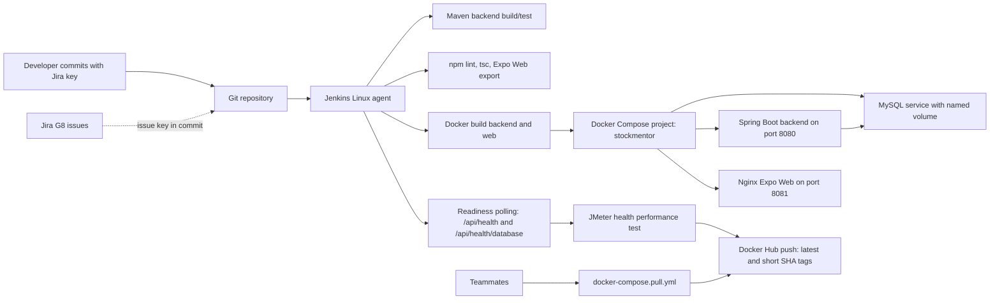

# StockMentor Deployment Architecture

## Coursework Architecture



## Backend

The backend is built from `backend/` using Spring Boot `4.0.5` and Java `17`. The Dockerfile is multi-stage:

- Maven builder image compiles and packages the backend.
- Java 17 runtime image runs the packaged JAR.
- Local secret config files are excluded by `.dockerignore`.

The backend exposes two public safe health endpoints:

- `GET /api/health` returns only `{"status":"UP"}`.
- `GET /api/health/database` returns only `{"status":"UP"}` or `{"status":"DOWN"}`. When the database is down, it returns non-200 status and does not leak database URL, hostname, username, exception text, token, API key, or password.

Protected API endpoints still require Basic Auth.

## Database

The simplest database deployment is MySQL as a separate Docker Compose service:

- Service name: `mysql`
- Named volume: `stockmentor_mysql_data`
- Backend container connection: `mysql:3306`
- Windows host and MySQL Workbench connection: `localhost:3307`
- Backend connects using environment variables:
  - `SPRING_DATASOURCE_URL`
  - `SPRING_DATASOURCE_USERNAME`
  - `SPRING_DATASOURCE_PASSWORD`
- MySQL healthcheck uses container environment variables and does not print passwords.
- Backend waits for MySQL readiness with `depends_on: condition: service_healthy`.

No Flyway or Liquibase migration tool is currently configured. For coursework Docker deployment, the Compose environment uses Hibernate `SPRING_JPA_HIBERNATE_DDL_AUTO=update`, so backend startup creates or updates tables based on JPA entities. This is explainable for Part A, but real production should use versioned migrations.

The two MySQL ports are not contradictory. Docker containers use the internal Compose network, so the backend JDBC URL uses `mysql:3306`. Windows host tools connect through the published host port `localhost:3307` because local port `3306` is already occupied.

## Frontend Web

The frontend Dockerfile uses the `frontend/` context:

- `npm ci`
- `npx expo export --platform web`
- Nginx serves the static `dist/` output
- Build argument: `EXPO_PUBLIC_API_BASE_URL`

Expo Web reads `EXPO_PUBLIC_API_BASE_URL` at build time. For the local Compose demo, the web frontend runs at `http://localhost:8081` and calls backend `http://localhost:8080`.

Nginx supports Expo Router client-side routing:

```nginx
try_files $uri /index.html;
```

This prevents nested route refresh from showing Nginx 404.

## CORS

The backend allows only configured origins. It does not use wildcard CORS with credentials.

For the local web deployment, use:

```text
STOCKMENTOR_CORS_ALLOWED_ORIGINS=http://localhost:8081,http://127.0.0.1:8081
```

The backend also keeps the existing `stockmentor.cors.allowed-origins` YAML property path for local development.

## Mobile

Mobile deployment for Part A is a demo connection story:

- Run the Expo mobile app on a phone or emulator.
- Set `EXPO_PUBLIC_API_BASE_URL` to a backend URL reachable by the device.
- Use LAN IP, ngrok, or a staging URL.

App Store and Play Store distribution are future work and not needed for this coursework part.

## Jenkins and JMeter

Jenkinsfile is Linux-only. It assumes a Linux agent with Java, Node, npm, Docker, Docker Compose, and JMeter installed.

Execution model:

- If Jenkins runs directly on the Linux Docker host, JMeter targets `localhost:8080`.
- If Jenkins runs inside Docker, `localhost` is the Jenkins container. Use a reachable host value or run JMeter inside the Compose network and target `backend`.

JMeter tests only:

- `/api/health`
- `/api/health/database`

It avoids OpenAI and Twelve Data endpoints.

The Jenkins report output uses a fresh per-build folder, `build/jmeter-${BUILD_NUMBER}/html`, before running `jmeter -e -o`. Jenkins archives `build/jmeter-*/**` in a `post { always { ... } }` block with `allowEmptyArchive: true`, so partial reports are still available after failures.

## Docker Hub

Image placeholders:

- Namespace: `DOCKERHUB_NAMESPACE`
- Backend image: `stockmentor-backend`
- Web image: `stockmentor-web`
- Tags: `latest` and short commit SHA

Jenkins pushes images only after build, Compose startup, health readiness, and JMeter pass.

## Production Future Work

For FYP interview or future production discussion, explain that this Part A setup is not a full production platform. Good future improvements:

- HTTPS and domain name
- Cloud VM or container service
- Managed MySQL
- Flyway or Liquibase migrations
- Jenkins credential hardening or a real secret manager
- Centralized logs and monitoring
- Backup and restore plan
- Blue/green or rolling deployments
